# 🌌 **kanban_simple**

A **simple and sleek Kanban board application** built with **Vue 3** and **Vite**, featuring a **responsive Galaxy-themed UI**.  
Powered by **Supabase** for authentication, database, and backend functionality.

---

## ✨ Features

- 📝 Task creation, editing, and deletion  
- 📁 Project and column management  
- 🔐 User authentication (register/login)  
- 👤 Profile editing  
- 🌌 Beautiful **Galaxy theme** for a modern aesthetic  
- ✅ **Backend powered by Supabase**:  
  - User authentication  
  - Real-time project/task data  
  - Storage

---

## 🚀 Installation Guide

```bash
# 1. Clone the repository
git clone https://github.com/your-username/kanban_simple.git

# 2. Navigate into the project directory
cd kanban_simple

# 3. Install dependencies
pnpm install
```

---

## 🔧 Supabase Setup

Create a `.env` file in your project root with the following variables:

```env
VITE_SUPABASE_URL=your_supabase_url
VITE_SUPABASE_KEY=your_supabase_key
```

Set up your Supabase project [here](https://supabase.io).

---

## 🛠️ Recommended IDE Setup

- **Visual Studio Code**  
- **Volar extension**  
  - ⚠️ *Ensure you disable Vetur for best performance*

---

## ⚙️ Project Commands

```bash
# Compile and Hot-Reload for Development
pnpm dev

# Type-Check, Compile and Minify for Production
pnpm build

# Lint with ESLint
pnpm lint
```

---

## 🧠 Type Support for `.vue` Files

TypeScript does not natively support `.vue` files.  
Use `vue-tsc` for type-checking and **Volar** in your editor for full language support.

---

## 🔧 Customize Configuration

Refer to the [Vite Configuration Reference](https://vitejs.dev/config/) for advanced settings.

---

## 📸 App Walkthrough (with Screenshots)

📂 _Upload screenshots in this section to display UI previews._

### 🔐 Login Screen  
> Secure login for returning users.
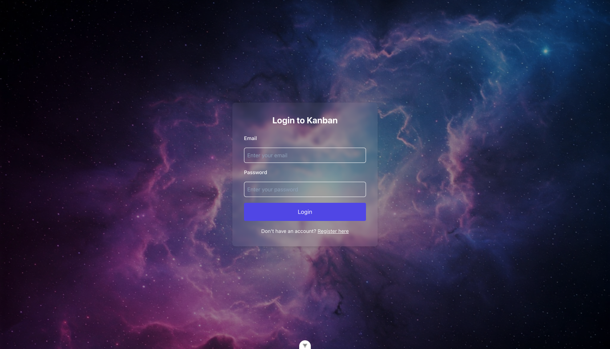


### 📝 Register Screen  
> Quick sign-up to get started.
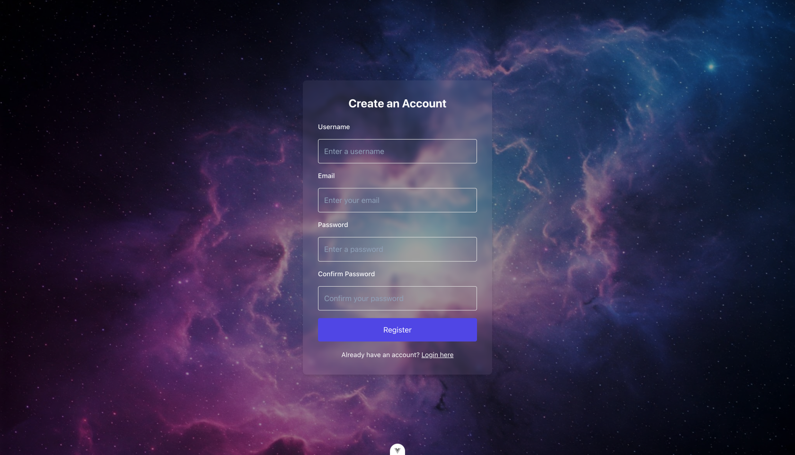

### 🏠 Home Page  
> Your main workspace overview.
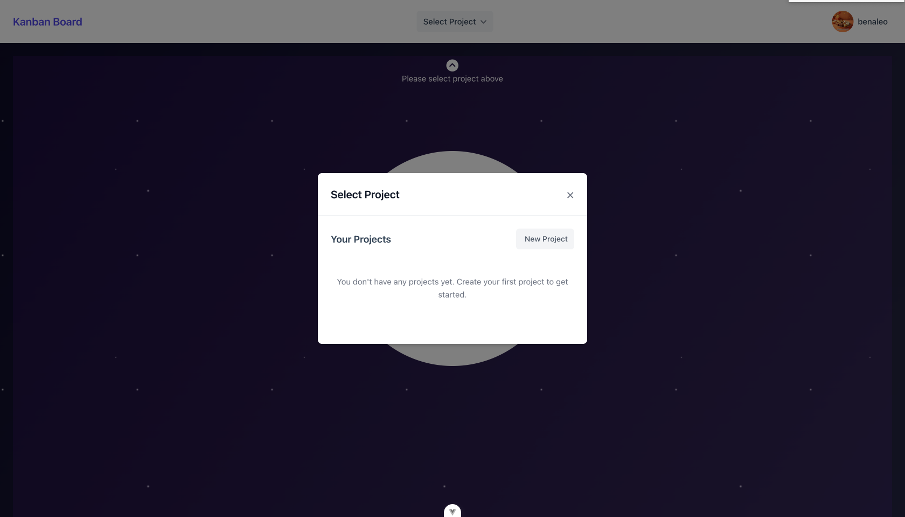

### 📭 Empty State  
> Prompt to select or create a project.
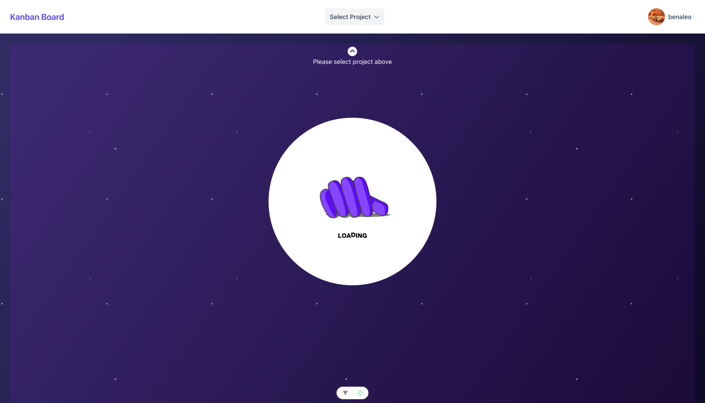

### 🗂️ Project Management  
> Create, rename, or delete projects.
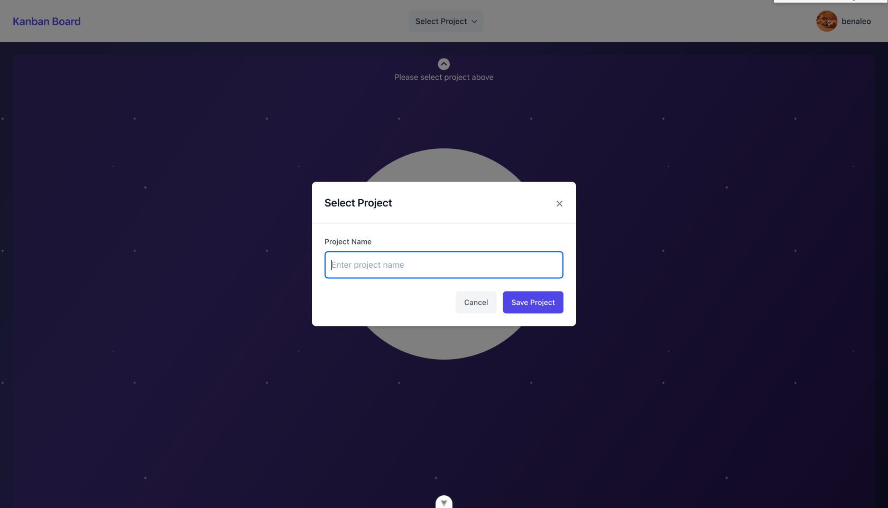
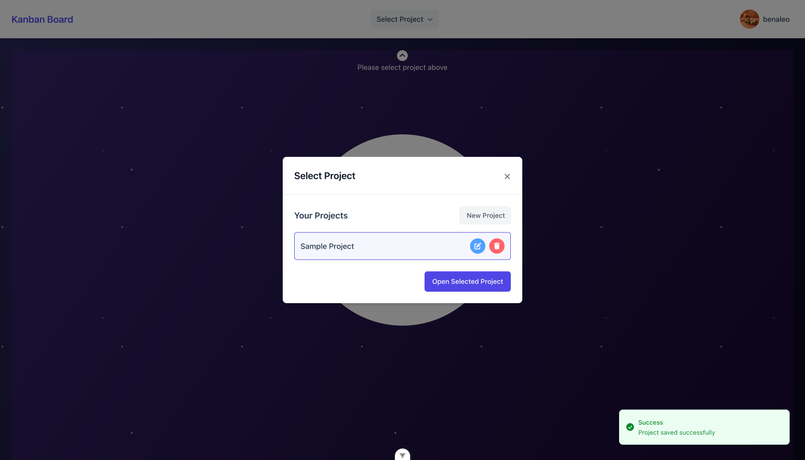
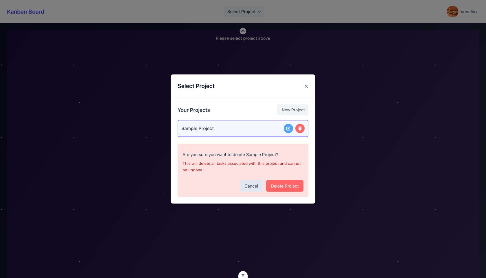


### ➕ Add Task  
> Add a new task to a selected column.

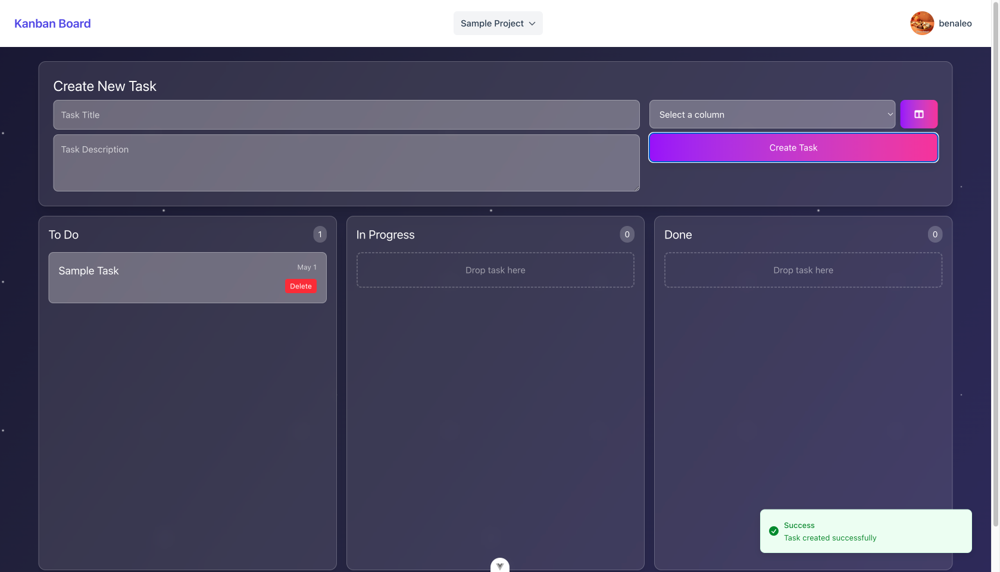

### ✏️ Edit Task  
> Modify details of an existing task.
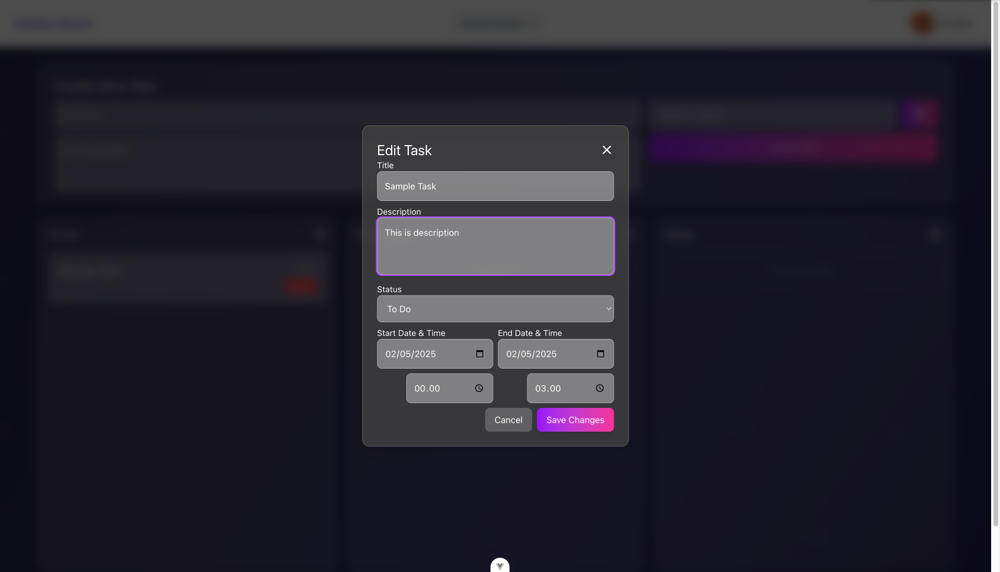

### 🧱 Column Management  
> Manage project columns (e.g., To Do, In Progress, Done).
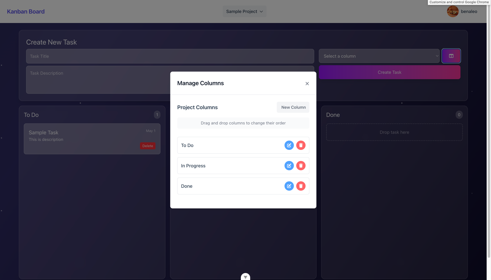

### 👤 Edit Profile  
> Update your user profile and settings.
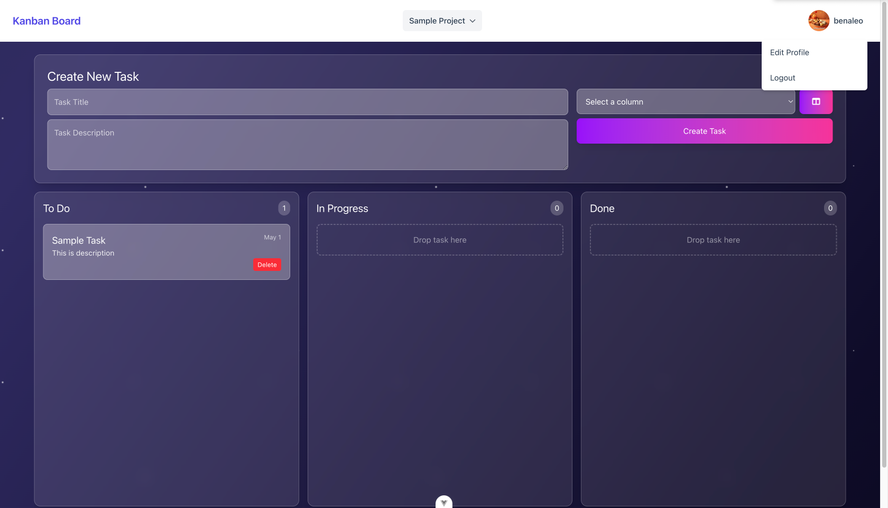
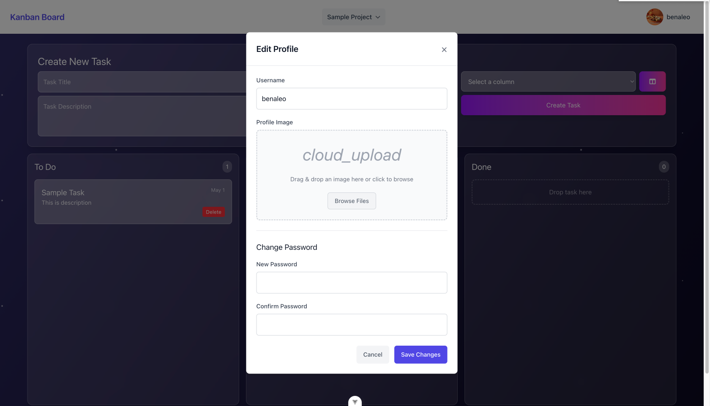


